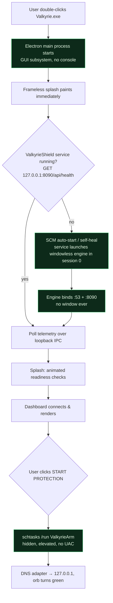

# ADR 0001 — Windowless engine & service-managed startup (zero console windows)

- **Status:** Accepted (2026-07-18)
- **Deciders:** Valkyrie desktop team
- **Supersedes:** the `console=True` frozen engine + script-launched startup

## Context

Launching Valkyrie could flash an Administrator PowerShell / console window
before the UI appeared. That makes a security product feel like a developer
tool. Investigation found **two** root causes:

1. **The frozen engine was a console-subsystem binary.** `valkyrie.spec` built
   `valkyrie.exe` with `console=True` → PE subsystem `WINDOWS_CUI` (3). Windows
   allocates a console for such a process on *any* interactive launch (portable
   child, `start_all` fallback, service-recovery edge cases). No amount of
   `-WindowStyle Hidden` on a *launcher* can suppress a window that belongs to
   the engine exe itself.
2. **Stale console-subsystem shortcuts.** An earlier PyInstaller-stub installer
   left Start-Menu shortcuts targeting `schtasks.exe` / `powershell.exe`
   ("Start Valkyrie Protection", …). Those targets are console-subsystem, so
   double-clicking them flashes a console.

## Decision

Treat the engine as a proper **background daemon** and let the OS service
manager own its lifecycle. Specifically:

1. **Windowless engine.** Build `valkyrie.exe` as a GUI-subsystem app
   (`console=False` → subsystem `WINDOWS_GUI` (2)). It runs `--no-ui` and logs
   to files, so it needs no console. `run_valkyrie.py::_ensure_std_streams()`
   points `sys.stdout/stderr` at `os.devnull` when launched without a console,
   so a stray `print()`/Rich write can never crash the daemon.
2. **SCM-owned lifecycle.** The engine runs as the auto-start Windows service
   **ValkyrieShield** (via NSSM) in session 0 — invisible, with restart-on-
   failure recovery. This is the single source of "the engine is running".
3. **Electron is the only user-facing process.** `Valkyrie.exe` (GUI subsystem)
   is the sole window. It talks to the engine over loopback HTTP/IPC and never
   opens a console, browser, or localhost page.
4. **Silent privilege escalation.** Protection arm/disarm run through
   pre-registered *highest-privilege* Scheduled Tasks (`ValkyrieArm` /
   `ValkyrieDisarm`) whose action is `powershell.exe -WindowStyle Hidden …`.
   Triggering a pre-registered task never re-prompts UAC and shows no window.
5. **Every spawn is windowless.** All `child_process` / `execFile` calls in the
   shell pass `windowsHide: true`; PowerShell self-elevation uses
   `-WindowStyle Hidden` and drops `-NoExit`.
6. **No console-subsystem shortcuts.** Only `Valkyrie.lnk → Valkyrie.exe`
   ships. The stale `schtasks`/`powershell` shortcuts are removed.

## Startup flow (after this decision)

No node in this flow allocates a console: the engine is GUI-subsystem and
SCM-owned; the shell is GUI-subsystem; privilege escalation is a hidden,
pre-authorized task.

## Consequences

- **Positive:** zero console windows on launch or protection toggle; matches
  Defender/Steam/Discord-class startup. Engine survives reboots and crashes via
  SCM recovery. Portable mode spawns the *same* windowless engine as a child, so
  it is console-free too.
- **Trade-off:** engine stdout/stderr are no longer visible on a console; they
  go to `%ProgramData%\Valkyrie\service_std*.log` (NSSM) or `os.devnull`.
  Developers use the source build (`python -m valkyrie`) for live console output.
- **Verification:** `tests/no_console_startup.ps1` asserts the shipped engine is
  subsystem 2 and that launching it (and the app) spawns no new
  console/PowerShell/cmd process. Wired into the release build audit.

## Alternatives considered

- **Hide the console with `ShowWindow`/`FreeConsole` at runtime.** Rejected:
  the window still flickers before the hide call wins; it is a hack, not an
  architecture, and races on slow machines.
- **Suppress the console only at spawn time (`CREATE_NO_WINDOW`).** Necessary
  but insufficient — it does not cover every launch path (portable, shortcuts,
  recovery). The subsystem must be GUI at the binary level.
- **Run the engine as `pythonw`.** N/A for a frozen single-exe product; the
  subsystem flag is the frozen-build equivalent and is what we set.
