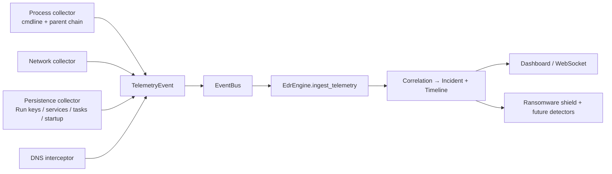

# ADR 0002 — Endpoint telemetry expansion (process context + persistence)

- **Status:** Accepted (2026-07-18)
- **Context:** endpoint visibility is the force-multiplier gap — it strengthens
  ransomware, behavioral, exploit, malware, and forensics detection at once, so
  it precedes new detection engines (per the gap-analysis roadmap).

## Decision
Expand endpoint telemetry by **enriching existing collectors and adding new
user-space pollers that emit the existing `TelemetryEvent` schema into the
existing `EventBus → EdrEngine.ingest_telemetry → correlation → incident`
pipeline.** No parallel systems, no new store, no new UI surface. Also enable
`--endpoint` in the shipped `ValkyrieShield` service so the collectors actually
run in production (they were previously off).

Phase 1 (this change):
1. **Process context** (`process_telemetry.py`) — capture the **full command
   line** and the **parent-process name chain**, and classify the command line
   (`classify_cmdline`): encoded/obfuscated PowerShell, in-memory download
   cradles, hidden/non-interactive flags. Enrichment runs only for *new*
   processes, so per-poll cost stays flat.
2. **Persistence / ASEP** (`persistence_telemetry.py`, new) — poll the four
   highest-signal auto-start classes and emit `category=persistence` on any new
   entry: registry **Run/RunOnce/Winlogon** keys, **Windows services**,
   **Scheduled Tasks**, **Startup folders**. Read-only via `winreg` + filesystem;
   no console, no external process.

Each label maps to a MITRE technique in `edr/engine.py::_TELEMETRY_TECHNIQUE`
(T1059/T1027/T1105/T1564 for process; T1547/T1543/T1053 for persistence).

## Architecture rationale
- **Schema reuse over new plumbing.** `TelemetryEvent` is source-agnostic by
  design; new signals ride existing common fields plus `fields`, so the
  correlator and dashboard reason over them without change.
- **EDR pipeline, not the Threat Graph.** The Threat Graph is domain/IP-centric
  (`record_threat(domain, ip)`); process/persistence entities don't belong there
  today. The EDR engine already correlates telemetry into incidents with
  timelines — that is the right home. A process-entity graph is a future,
  separate extension.
- **Pollers now, ETW later.** User-space pollers are portable, need no driver,
  and never crash the host. They are the honest seam that a future ETW/kernel
  sensor replaces while emitting the *same* schema — an additive upgrade.

## Threat model
**Catches (post-write, within the poll interval):**
- LOLBins launched with obfuscated/encoded commands or download cradles
  (`powershell -enc …`, `IEX (New-Object Net.WebClient).DownloadString`).
- Office application spawning a shell/script host (macro malware), now with the
  parent chain and command line for triage.
- Persistence establishment: new Run key, service, Scheduled Task, or Startup
  item — the near-universal step attackers take to survive reboot.

**Explicitly does NOT catch / assumptions:**
- **Race window:** a process that starts and exits, or persistence added and
  removed, entirely between polls can be missed. Not real-time.
- **Privilege:** HKLM keys, all-user services/tasks, and other users' Run keys
  require admin/SYSTEM (the service runs as SYSTEM — good; a source run as a
  normal user sees less).
- **Tamper-resistance:** a poller can be blinded by a kernel-level attacker.
  User space cannot defend against ring-0.
- **No content inspection** of scripts/DLLs; command-line/heuristic only.

## Benchmarks (this machine)
- Persistence snapshot of **925 ASEP entries: 7.4 ms** (`test_endpoint_telemetry`).
  Default poll interval 15 s → negligible steady-state cost.
- Process enrichment: one `cmdline()` call per *new* process only, not per
  process in the table.

## Tests
`tests/test_endpoint_telemetry.py` — 11/11: command-line heuristics, event
enrichment, persistence severity, `_exe_from_command`, a **real HKCU Run-key
detection** (plant encoded-PS value → HIGH incident), synthetic startup-file
detection, silent-baseline invariant, and the snapshot benchmark.

## Honest boundaries → next increments (not yet built; all plug into the same seam)
| Priority signal | Why not in phase 1 | Path to enterprise |
|---|---|---|
| DLL/module load monitoring | Per-process `memory_maps` diffing is heavy to poll broadly | ETW `Image/Load` provider → TelemetryEvent |
| WMI event-consumer persistence | Needs WMI/COM enumeration | `wmi`/COM poll of `__FilterToConsumerBinding`, or ETW WMI-Activity |
| PowerShell script-block logging | Content logging is event-log/ETW only | Consume `Microsoft-Windows-PowerShell/Operational` 4104 |
| Broad registry & file operations | RegNotify says "changed", not who/what | ETW `Registry` + `FileIO` providers with PID attribution |
| Real-time + tamper-resistance | User-space poller limitation | ETW sensor / kernel minifilter (see ADR 0001 seam) |

Reaching commercial parity is additive: each new sensor emits `TelemetryEvent`
and calls `ingest_telemetry`; nothing downstream changes.
